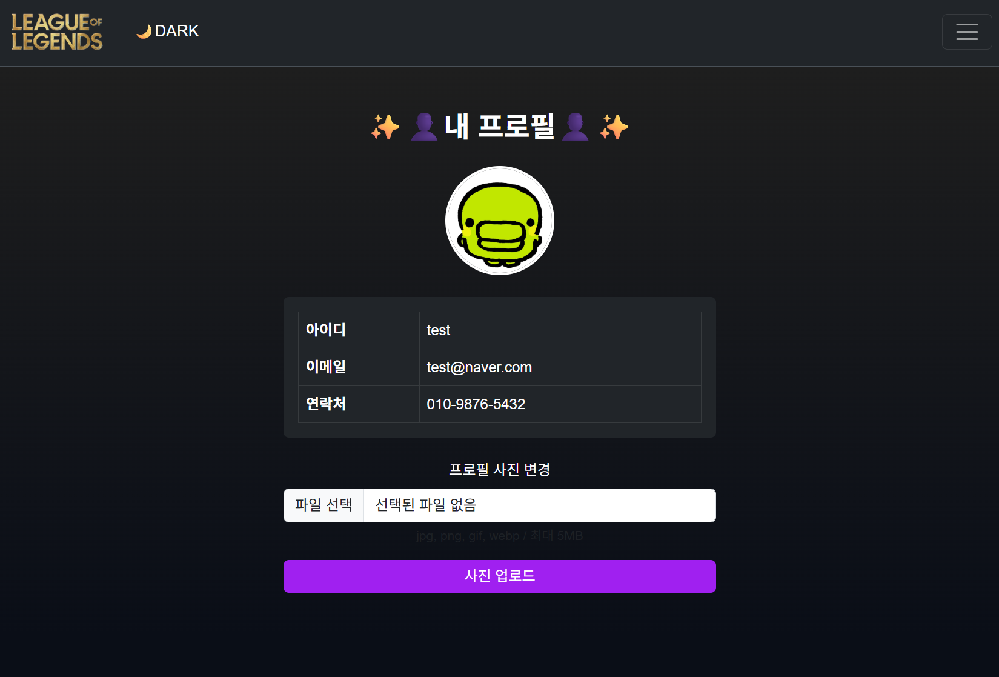
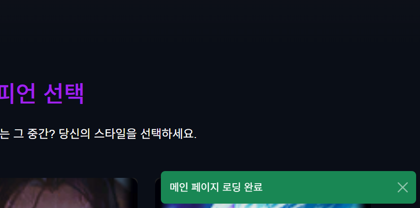

# quarkus 프로젝트 시작! (학번 : 20241402 이름 : 장예지)
매 주 수업 내용을 정리하자.
## 4주차 정리
실습 1 : html, css
실습 2 : 모달창 구현
 
## 간단한 html과 css에 대해서 배우게 되었다. html을 수정하며 챔피언 세부 정보를 출력하기 위해 모달창을 구현하여 챔피언의 다양한 스킬들과 궁극기, 그리고 챔피언에 대한 간단한 설명 등을 적었다. 또한 href로 이어지는 기본 값은 "#"인데, 이것은 비어있는 상태를 이야기하며 링크를 연결하고 싶다면 html페이지의 이름을 적거나 아니면 외부페이지 링크를 가져오는 방법이 있다는 것을 알게 되었다. 그러나 잘못된 주소를 넣는다면 404 오류가 뜰 수도 있으니 주의해야 한다.

## 5주차 수업 완료
실습 1 : 다운로드 페이지 제작
 
## 다운로드 페이지 실습을 들어가며 테이블 요소의 태그들을 알게 되었다. <tr>과 <td> 그리고, 다운로드 페이지 안에서 정말로 파일을 다운받을 수 있도록 만들었다. 추가로 다운로드 페이지 안에 있는 사진을 lol과 관련된 사진으로 바꿨으며 네비바의 메인이 되는 로고의 이미지도 직접 포토샵으로 누끼를 따서 모든 ima src에 올려놨다. 

## 7주차 수업 완료
실습 1 : 자바 스크립트 검색 페이지
실습 2 : html 검색 페이지 제작
 
## 이번주차부터 본격적인 자바스크립트에 대해 들어갔다. 메인화면의 html을 수정하며 자바스크립트에도 인라인 방식, 프로퍼티, 이벤트 리스너 등 다양한 방식이 있다는 것을 알게 되었으며 각각의 특징을 알게 되었다. 챔피언들의 데이터도 저장하며 챔피언을 검색할 수 있는 기능 또한 구현했다. 그 과정에서 일반 배열과 객체 배열을 알게 되었다. 

## 중간 제출
중간 정리 : 중간 시험 전까지 배웠던 html, css, js를 간단히 정리하자. 모달창을 제작하여 각 챔피언마다 상세 정보 창을 만들었다. 또 section과 div의 차이점을 알게 되었으며 img src 가져오는 방법, css에서 .은 class를 뜻한다는 것을 알게 되었다. html에서 col-md, col-lg, col-xl는 화면에 따라 카드들이 몇 칸인지 나타내는 것을 알게 되었다. js를 따로 적어서 script로 가져오는 방법이 있고 html 내부에 직접 적는 방법이 있는데, 내부에 적는 것보다 따로 제작해서 script로 가져오는 방법을 선호한다. 또한 웹 페이지 보강을 위해서 3명의 챔피언을 추가로 적었고 고화질의 사진과 함께 상세 모달창도 각 챔피언들의 특성에 맞게 구현해놨으며 챔피언 간단 설명도 알맞게 변경해놨다. js를 내부에 적는 즉, 인라인 방법으로 메인 화면을 로딩하는 창을 만들었다.

## 9주차 수업
실습 1 : 다크모드 / 라이트모드 구현
 
## 간단하게 다크모드와 라이트모드를 웹페이지에 구현했다. 처음에 웹페이지를 제작할 땐 다크모드로 진행되었지만 이번 기능을 구현하며 다크모드에서 라이트모드로 변경할 수 있게 되었다. 왼쪽 상단에 'DARK'라는 단어를 누르면 'LIGHT'로 바뀌는 classList.toggle()을 사용했다. 또한 9주차부터 백엔드를 위한 준비를 시작하였다. 데이터베이스인 MySQL을 연동하여 기본적인 시작단계의 실습을 진행했다. 

## 11주차 수업
실습 1 : 로그인 / 로그아웃 페이지 제작
실습 2 : 회원가입 페이지 제작
 
## 로그인, 로그아웃 페이지를 제작하며 로그인 성공시 /main_after_login으로 넘어가고 실패시 현재 있는 페이지에 그대로 남아있는 설정을 마쳤다. 회원가입 페이지를 제작하며 아이디와 비밀번호, 이메일, 전화번호 입력 양식을 만들며 사용자가 정보륵 입력하고 말 그대로 회원가입을 하도록 만들었다. 그로 인해 웹페이지에서 사용자 정보를 입력 받는 구조를 알게 되었다. 

## 13주차 수업
실습 1 : 프로필 페이지 제작 및 사진 변경
실습 2 : 기존 알림창 변경

    
    

 
##  프로필 페이지 화면 작성과 프로필 사진 올리기, 알림창 변경, showToast() 함수를 추가했다.세션에 사용자 정보를 넣기 위해선 context.session().put()이란 함수를 써야된다. 프로필 페이지에서 세션 체크를 하는 이유는 사용자를 확인하고, 확인 되면 프로필 페이지를 반환하지만 세션이 없으면 /login을 차단한다.  그렇다면 사용자 정보를 얻기 위해선 context.session().get()을 사용해야 한다. 프로필 변경을 위해서는 AuthResource.java를 변경해야 하는데 첫번째로 세션 체크를 하고 그 다음 확장자 검사, 파일 크기 검사(5MB), UUID 파일명 생성 및 저장, DB 업데이트를 한 뒤 빌드한다. 

## 1학기 수업 총 정리
실습 1 : html, css, js 
실습 2 : java

    
    

 
## html, css, js 그리고 java까지 Quarkus를 기반으로 실습해봤다. 지금까지 해왔던 실습들을 위주로 정리를 해보려고 한다.(중간고사 이후 위주로 정리!)
 
9주차에서는 일반 배열과 객체 배열의 차이부터 배웠다. 속도는 일반 배열이 훨씬 빠르다. 맨 위 package org.acme;는 패키지 선언이다. 다크모드, 라이트모드에서 쓰인 classList.toggle('light-mode)는 클래스 없으면 추가, 있으면 제거하라는 뜻이고 그 외에도 remove()/add()함수가 있다. ()안에 내용을 말 그대로 삭제하거나 더하라는 뜻이고 btn.context는 버튼 안의 텍스트를 현재 모드에 맞게 변경해준다. #은 잊어서 다시 정리를 하면 id선택자라는 뜻이다. 특히 '@'가 중요한데 이름이 어노테이션(or애노테이션)이라고 한다. 이 코드의 역할은 이거야. 라고 알려준다. 그 외에도  MySQL 연결 드라이브를 쓰는 artifactID와 sql대신 java 객체로 편하게 다루게 해주는 ID 등이 들어가 있다. 자바와 자바스크립트의 차이점은 JAVA는 엄격하고 명시적인 대신에 JS는 유연하고 동적이라는 것이다.
 
## QuarkusMain.main()이 시작 -> Arc(CDI 컨테이너)로 넘어간다. 어플리케이션 하나 당 포트번호 1개여야되고 포트 번호가 겹치면 안 된다! DB 연결 설정도 진행했다. 우린 mysql을 사용하니 종류를 mysql로 하고 접속 계정과 접속 주소 등등 연결해놨다. @는 어노테이션, Entity는 테이블을 뜻한다. @Path는 경로를 지정해주고 @GET은 GET요청 처리 후 목록을 반환, @POST는 POST요청 처리 후 데이터 저장한다. '*'은 REST기능들을 한꺼번에 가져오는 것이다. @Transactional은 DB 저장 안전 기능이다. if (Champion.count() > 0) return; -> 이미 데이터가 있으면 중단하라는 뜻! persist는 영구 저장이라고 한다. 
 
## inputstream으로 파일 데이터를 가져오면 .getClassLoader()로 클래스를 읽어오고 .getResourceAsStream()으로 웹페이지를 읽어오면 return Respone.ok(html).build(); 웹 응답을 정상 성공해서 빌드한다! 로그인 실패시 이동할 때 에러 표시로 ?error=1이라고 표시한다. .seeOther()은 페이지 이동 메서드다.
태그는 줄을 만들어주는 태그이며 form에는 항상 id가 붙어있다. 데이터를 전송할 떈 post method="post"!
 
## 아이디 검사, 비밀번호 검사, 이메일 검사, 전화번호 검사 등을 진행하는 암호문이 있다. hashPassword(password); -> 비밀번호를 해시화하는 코드다. fetch('/profile/info’) -> 서버에서 사용자 정보를 요청한다. 또, 기존에 html에 적은 js를 변경해줬다. showToast()함수를 사용해 알림창을 변경했다. alert()와 Toast()의 차이는 디자인을 변경할 수 있다는 것과 실제 서비스에서 Toast가 표준이라는 것, 그리고 사용자 조작도 Toast가 훨씬 편하다는 것이다. data-bs-toggle="tooltip" -> 이건 tooltip임을 선언하는 것인데, 프로필 아래에 사용자의 이름을 동적으로 표시해준다. 
 
## 한 학기 동안 웹페이지를 만들면서 생각했던 것은 웹페이지 하나를 구현하는데에 이렇게 많은 시간을 들여야한다는 것과 내가 평소에 보고 살던 웹페이지들은 디테일이 엄청나다는 것을 알게 되었다. 또한 웹페이지를 구현하며 느꼈던 점은 페이지 제작에 대한 흥미가 생겼다는 것이었다. 비록 플스텍을 하느라 중간고사 이후부터 백엔드를 할 땐 조금 어려워서 따라가기 벅찼지만 그래도 내가 아는 웹페이지의 윤곽이 점점 보이는 것 같아서 기능을 구현하면서, 또 html과 css로 웹 페이지의 프론트부분을 만들면서 신기한 감정이 들었고 무엇보다 완성된 웹페이지가 나에게는 뿌듯한 감정으로 몰려왔다. 처음에는 단순히 결과물만 보던 웹페이지를 이제는 직접 만들 수 있게 되면서 웹 개발에 대한 흥미가 더욱 커졌고, 앞으로도 새로운 기술을 배우며 더 완성도 높은 페이지를 제작해 보고 싶다.